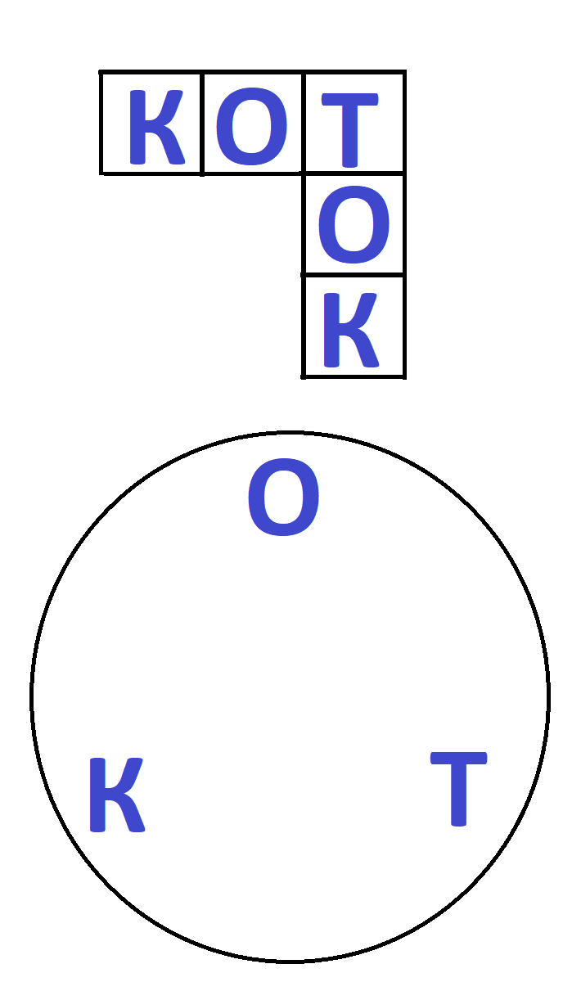
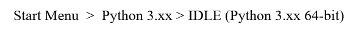
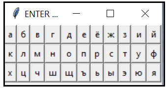
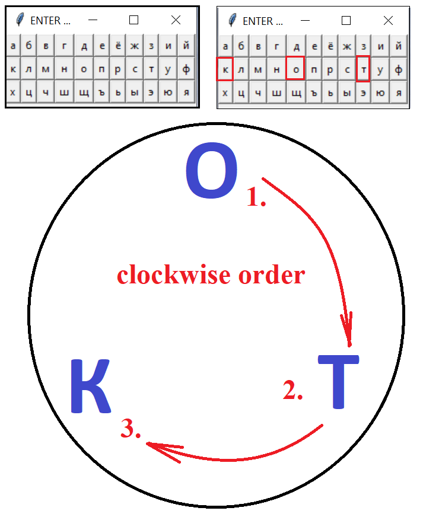
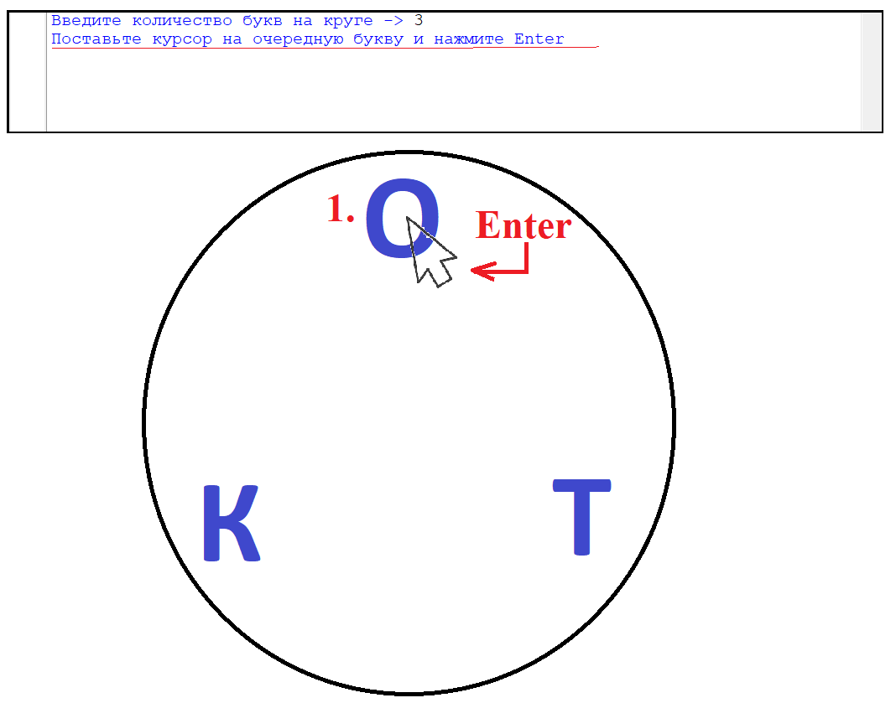
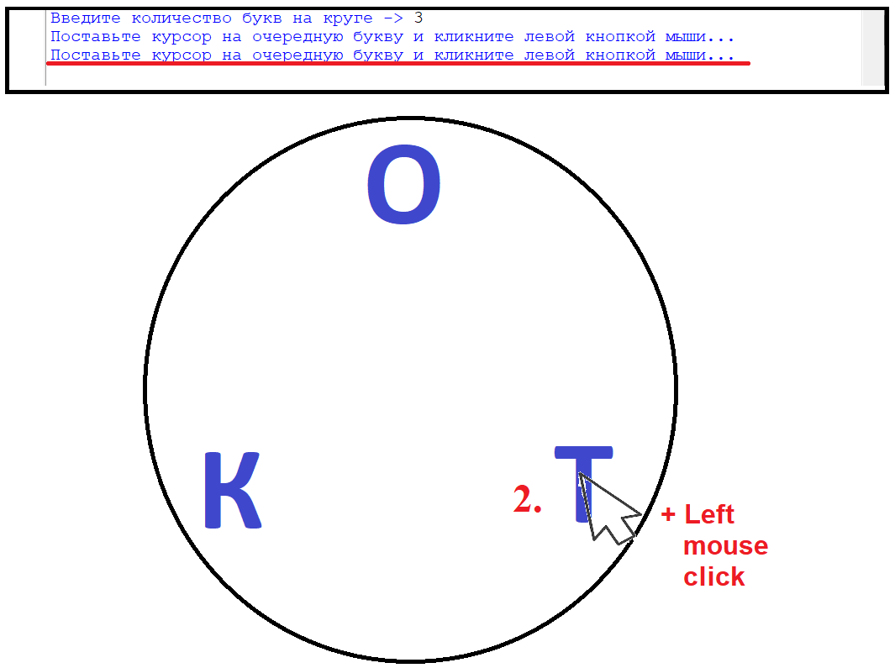
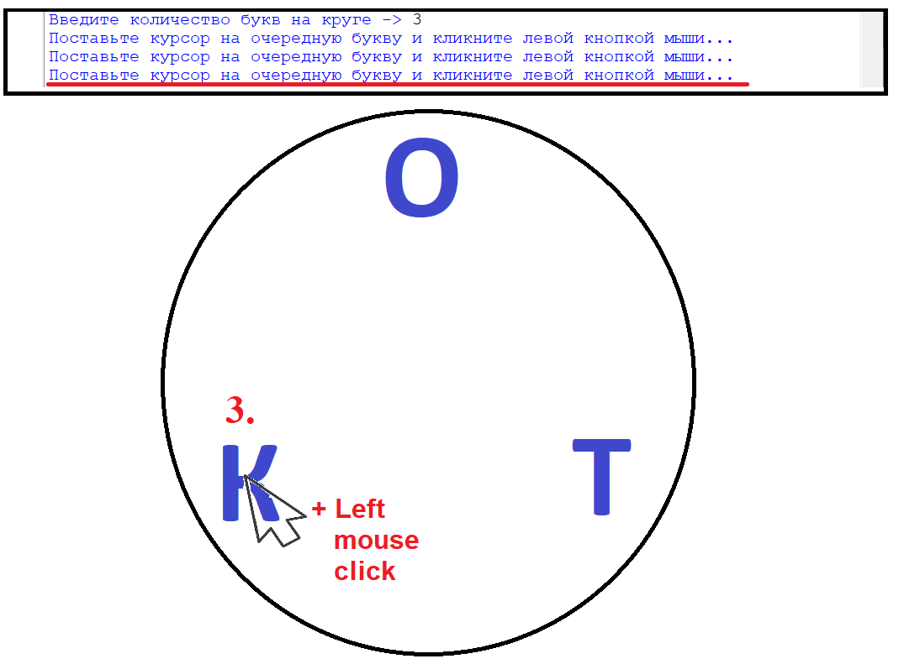

# Сrossword Solver
Python project to solve crosswords by automatically selecting given letters with mouse pointer on the computer screen.

# Version
1.0.0-beta.2

# Description

There are many wonderful crossword games where letters are arranged in a circle and you connect them to form words, 
which are then inserted into the crossword (see Picture1 below).
This program is capable of solving such crossword puzzles automatically.

# Installation
This program is for Windows only.
You should install Python envoronment first (https://www.python.org/downloads/).
Then, transfer the python-file (main_module.py) from the \src-folder of this repository to any folder of your Windows OS.

# Usage
There are many wonderful crossword games where letters are arranged in a circle and you connect them to form words, 
which are then inserted into the crossword (see Picture1).

												Picture1

This program is capable of solving such crossword puzzles automatically.

Run python-file main_module.py by double clicking or by using IDLE Python (see Picture2).

												Picture2

The program window with the crossword puzzle should already be running, and no other windows should be covering it.
The program will start working and in the command window will issue a contextual request: to input the number of letters for the current crossword puzzle.
You should type the number of letters for the current crossword puzzle, then press Enter (see Picture3).

												Picture3

After this, a panel with letters will appear (see Picture4), on which you need to sequentially click on the letters contained in the circle.

												Picture4

The letters are clicked on the panel starting from the top one, which is located at 12 o'clock inside the circle, and further clockwise (see Picture5).

												Picture5

Let's assume that all letters are entered. The program will then wait for the screen coordinates of the letters on the circle to be entered.
This is done by placing the mouse pointer on a letter and by clicking the left mouse button.
The letters must be clicked in the same order in which they were entered on the letter panel, 
that is, starting with the top letter located at 12 o'clock and moving clockwise (see Pictures 6-8).

**IMPORTANT NOTE.**

**The successful completion of reading the specified positions of each letter is indicated by the appearance of a new message in the program command window: “Place the cursor on the next letter and click the left mouse button...” (see Figures 6-8)._**

												Picture6

												Picture7

												Picture8

When all the letters from the circle are pointed in this way, the program will immediately begin work on solving the crossword puzzle.
First, the new message in the program command window is printed: “Remember! You can stop the program at any time by pressing the SPACE key.”
Then the mouse pointer moves across the screen automatically and selects letters, cycling through all possible words. The program exits when all words have been searched.
But you can stop the program at any time by pressing the SPACE key.

**IMPORTANT NOTE.**

**_The program uses a complete search of combinations of letters in a loop. If you see that the crossword puzzle has already been solved, but the program continues to move the mouse and is still “typing words”, then you should stop it by pressing the SPACE key !_** ⌨

**Attention! Be careful!** ⚡

**After you have pointed the screen coordinates of all letters to this program (as You see on Pictures 6-8), do not move the crossword puzzle window, do not minimize it or change its scale!**
**Also, do not cover it with other application windows on the screen!**
**Do not press any keys on your keyboard (except the SPACE key) and do not move your mouse while this program is running!**

**All this can lead to incorrect crossword solutions, as well as accidental damage or deletion of files on your desktop.**
**If you need to immediately emergency stop this program, press the SPACE key.**

**WARNING!**
**THE USER USES THIS PROGRAM AT YOUR OWN RISK. THE DEVELOPER IS NOT RESPONSIBLE FOR ANY LOSSES INCURRED BY THE USER OR ANY OTHER PERSONS AS A RESULT OF THE RUNNING OF THIS PROGRAM.**
**IF YOU ARE CONCERNED THAT ANY DATA IN YOUR SYSTEM WILL BE DAMAGED AND YOU WILL EXPERIENCE FINANCIAL OR OTHER DAMAGE,DO NOT RUN THIS SOFTWARE ON YOUR COMPUTER.**

# Further development

The user can further improve the code.
For example:
- insert a code to enter letters through the microphone using NLP;
- insert code for AI recognition of letters on a circle and automatic determination of their screen coordinates;
- insert a code to check letter combinations for belonging to words of a literary language, but not to a random set, before sending them to the crossword puzzle;
- insert code to launch the program as an AI agent when the crossword program window appears on the computer screen;
and so on.

# Platform Requirements

⚠️ **This code is the Windows Only Project!**
## Reasons:
- Uses `ctypes.windll.user32` to emulate a mouse movements/clicks
- Windows-specific API to control the cursor and clicks

## Dependencies:
- ✅ **No external dependencies**
- ✅ Uses only standard Python libraries
- ✅ OS Windows 10+ required
- ❌ **Doesn't work on Linux/Mac OS**

# License

This project is distributed under [MIT License](LICENSE).

## License dependencies
- **Python**: The project uses Python, which is distributed under 
  [Python Software Foundation License](https://docs.python.org/3/license.html)
  Copyright (c) 2001-2025 Python Software Foundation License
- **Standard Libraries**: All modules used are part of Python and are distributed under the same PSF License
